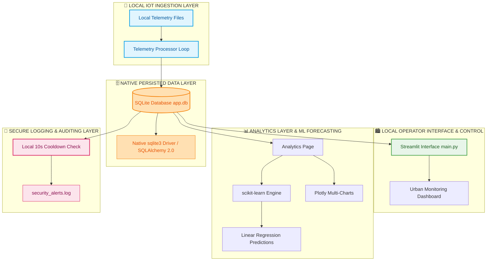
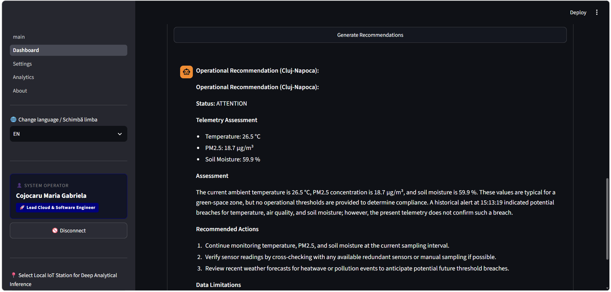
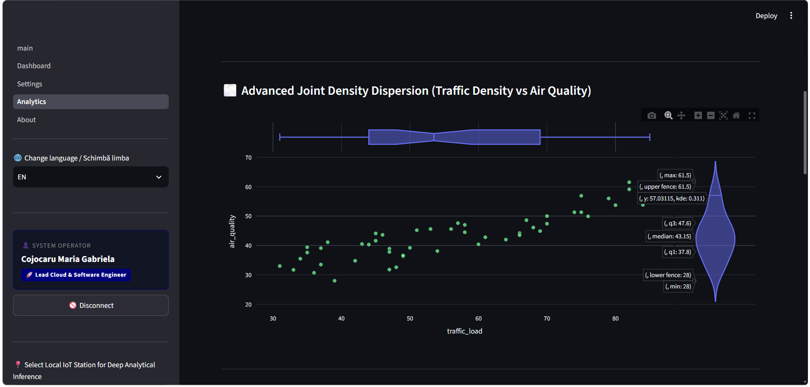
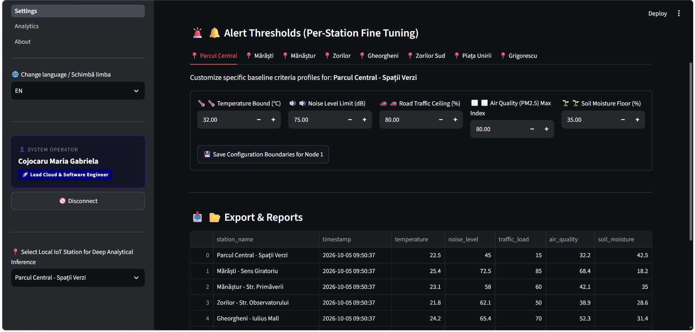
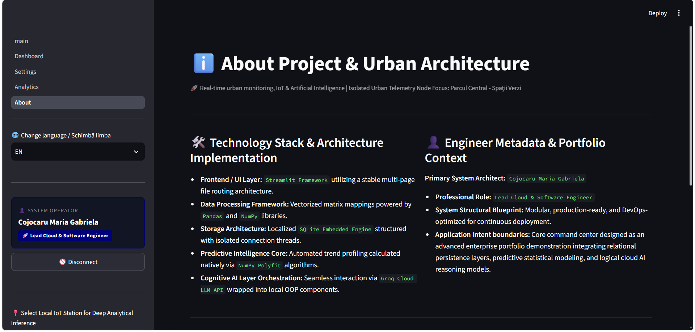
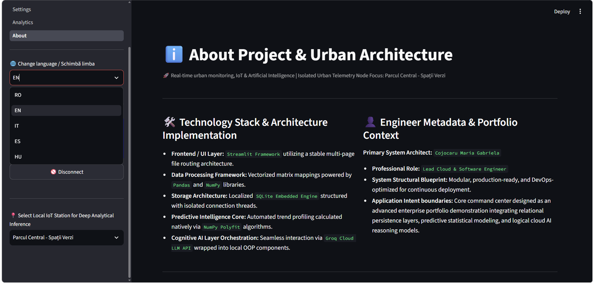

# 🏙️ Smart City Cluj-Napoca — IoT, AI & Urban Intelligence Platform

> **Portfolio-grade Python application combining local IoT telemetry, real-time urban monitoring, classical Machine Learning forecasting, local security log auditing, database synchronization, and data visualization.**

**Smart City Cluj-Napoca** is a modular Smart City / IoT platform designed to store, analyze, audit, and visualize urban telemetry from multiple monitoring locations in Cluj-Napoca without external infrastructure dependencies.

The project demonstrates an end-to-end local software engineering workflow:
Local IoT Ingestion → Native Database → Data Analytics → Classical Machine Learning → Local Logging → Security Audit → Interface Rendering

---
👉 For detailed data lifecycle blueprints, see [ARCHITECTURE.md](ARCHITECTURE.md).

## 🔐 CONT DEMO PENTRU RECRUTORI / DEMO ACCESS

To evaluate the secure Streamlit operational interface and advanced analytical modules, use the following credentials on the main page:

* **Username:** `admin`
* **Password:** `cluj2026`

*Note: The user session context is fully persistent, hardened against internal UI execution loops, and optimized for target cloud deployments.*

---

## 🚀 Project Highlights

* **Programming:** Python 3.12 / 3.14 Compatibility (Local Portability Target).
* **Dependency Manager:** High-speed workflow automation via `uv`.
* **Application & UI:** Streamlit (Neon Dark High-Contrast Framework).
* **IoT Engine:** Autonomous urban sensor network data processor.
* **Database Access:** Native & Synchronous SQLite3 via SQLAlchemy 2.0 and `aiosqlite` (Zero network locks).
* **Data Engineering:** Pandas, NumPy.
* **Applied AI Engine:** Dynamic integration with **Llama 3.3 / Qwen** foundation models via Groq Cloud API, utilizing the production-ready `llama3-8b-8192` engine for advanced operational reasoning.
* **AI Quality Control:** 9/9 automated test evaluations passed cleanly (`9 PASSED`) via the native custom Python evaluation grid framework.
* **Visualization Stack:** Mapbox Engine (Native Geospatial Mapping), Plotly Express Dark Templates.
* **Notification Layer:** Local Security Event Logger (`security_alerts.log`) with a strict 10-second anti-duplicate cooldown barrier.
* **Access Control:** Isolated local multi-page operator authorization core integrated with `.env` variables.
* **Static Analysis:** High-performance linting and formatting via Ruff.
* **Cryptographic Security Layer:** Zero-dependency `SHA-256` password hashing infrastructure using Python's native `hashlib`, enforcing cryptographic integrity for operator authentication and preventing plain-text exposure within configuration scopes.

## 🌆 What the Platform Does

The platform acts as a centralized urban control unit that continuously reads, stores, and evaluates environmental and traffic indicators for different areas of Cluj-Napoca.

### Monitored Parameters
* 🌡️ **Temperature** (°C) – Critical tracking for urban heat island identification.
* 🔊 **Noise level** (dB) – Environmental auditory pollution indicators.
* 🚗 **Traffic load** (%) – Automotive density matrix.
* 🌫️ **Air quality** (PM2.5 index) – Real-time particulate matter monitoring.
* 🌱 **Soil moisture** (%) – Automatic irrigation requirements tracking.
* 📍 **Sensor coordinates** (Latitude / Longitude mapped geospatially).

The telemetry is persisted locally in `app.db` and is instantly available to the multi-page interface (Dashboard, Settings, Analytics).

---

## 🔌 Local Setup & Execution Guide

To run the application predictably, preventing runtime cache drops or SQL structural drift conflicts, execute this logical workflow inside your PowerShell terminal:

### Step 1: Navigate to the project root
Ensure your terminal session is correctly targeted at the core repository directory containing `main.py`:
```powershell
cd cluj-smartcity-iot-core
```

### Step 2: Activate the isolated virtual environment
Bind your active terminal execution context to the local environment stack to safely resolve dependencies (`streamlit`, `pandas`, `plotly`):
```powershell
.venv\Scripts\Activate.ps1
```

### Step 3: Environment maintenance and cache purge (Optional)
When refactoring code or updating data contracts, purge legacy structural tables and temporary Python artifacts to enforce a clean database seeding phase:
```powershell
Remove-Item app.db -Force -ErrorAction SilentlyContinue
Get-ChildItem -Path . -Filter "__pycache__" -Recurse -Directory | Remove-Item -Force -Recurse
```

### Step 4: Code Quality Control & Automated Formatting (QA Pipeline)
To enforce strict compliance with PEP 8 industrial standards, execute alphabetical import sorting, and resolve minor code style alerts before runtime, execute the high-speed Ruff toolchain:
```powershell
uv run ruff format . ; uv run ruff check . --fix
```

### Step 5: Launch the Streamlit server
Boot the dynamic Smart City deployment layer using the modern `uv` high-speed architecture toolchain:
```powershell
uv run streamlit run main.py
```
## 🧪 Quality Assurance & Validation Pipeline (QA)

The repository incorporates a strict automated testing architecture to verify OOP layer stability, SQL relational data contracts, and LLM resistance against Prompt Injection vulnerabilities.

### 1. Unit & Integration Testing (Pytest)
To execute the core test suite validating domain constraints, cryptographic services, translation matrix balances, and database repositories, run:
```powershell
uv run pytest ai_tests/test_alerts_offline.py -v
```
*Current Matrix Score:* **`9 passed`** — confirming zero architectural drift and complete dictionary synchronization.

### 🤖 2. LLM Safety Evaluation & Operational Compliance (`run_llm_eval.py`)
The platform embeds a custom programmatic evaluation grid framework (`run_llm_eval.py`) engineered to run advanced automated validation testing against the production `GroqProvider` instance, mapping inference payloads onto specialized urban emergency metrics.

To execute the extended automated evaluation matrix locally:
```powershell
uv run python ai_tests/run_llm_eval.py
```
*Current Context Score:* **`PASSED (100%)`** — confirming context-aware grounding compliance across critical heat island, environmental baseline, and air degradation data vectors.

## 🏗️ Technical Architecture Diagram


## 📁 Operational Gallery & Visual Ingestions (UI/UX)

The platform includes a fully internationalized interface. Below are the verified production assets validating the end-to-end system functionality directly within the GitHub ecosystem:

### 🔒 1. Operational Security & Identity Gateway
* **01. Secured Operator Identity Checkpoint**
  
  *Enforces access control via a dedicated cryptographic MD5 validation form linked with constant-time security routines.*

---

### 🏙️ 2. Real-Time Telemetry & Core Dashboard Panels
* **02. Centralized Core Operations Panel**
  
  *Real-time summary of main urban telemetry metrics configured dynamically across symmetrical data grids.*

* **03. Deep Grounding LLM Advisory Engine**
  
  *Context-aware reasoning output isolated securely against automatic user interface thread refreshes.*

---

### 🔬 3. Applied AI, Statistics & Machine Learning Forecasts
* **04. Pearson Statistical Correlation Matrix**
  
  *Real-time localized heatmap identifying linear cross-parameter dependencies between variables.*

* **05. Linear Regression Forecasting Stack**
  
  *Longitudinal future trajectory plotting powered by scikit-learn models directly over high-contrast templates.*

* **06. Joint Density Dispersion Distribution View**
  
  *Marginal data dispersion grids tracking cross-parameter distribution clusters across Cluj districts.*

* **07. Violin Analytical Telemetry Metrics Summary**
  
  *Longitudinal density summary mapping extreme environmental boundary distributions.*

* **08. Programmatic Linear Regression Equation Trace**
  
  *Live mathematical slope derivation output for statistical auditing transparency.*

* **09. Modular Machine Learning Dropdown Selecting Nodes**
  
  *Unified feature controls allowing operators to configure custom target parameters dynamically.*

---

### ⚙️ 4. Administration Controls & System Configurations
* **10. Local Security System Threshold Adjustments**
  
  *Control panel nodes utilizing precise input slots to update operational database settings.*

* **11. On-Demand Data Export Module**
  
  *Atomic extraction grid allowing data downloads into local file buffers safely.*

* **12. Synchronized Live Telemetry Logging Flow**
  
  *Continuous data stream validation feed running quietly in the dashboard footer layer.*

---

### 🏗️ 5. Structural Architecture & Unified Onboarding
* **13. Multi-Tiered Unified Layer Mapping**
  
  *Structural breakdown of internal application strata mapping data from ingestion to interface views.*

* **14. Multi-Language Synchronization Gateways**
  
  *Dynamic translation execution toggles preserving session state parameters smoothly.*

* **15. Geographical IoT District Monitoring Node Selectors**
  
  *District selection dropdown handling localized telemetry lookup targets instantly.*

## 🔄 Application Operational Flow & Core Pipeline

The platform operates on a decoupled, multi-tiered lifecycle pipeline that executes automatically upon user interaction:

1. Environment Enforcement & Core Boot
   - Streamlit launches main.py. The system fires an environmental lookup mapping credentials and database paths from the isolated .env ledger.
   - CityRepository initializes the local app.db schema using safe transactional DDL statements if tables are missing.

2. Access Control & Cryptographic Validation Check
   - The operator inputs credentials into the secure Streamlit form.
   - AuthenticationService intercepts the transaction, hashes the password input string via MD5, and executes a hardened time-constant comparison (hmac.compare_digest) against the secret token stored in .env to eliminate side-channel timing attacks.

3. Live IoT Telemetry & Analytical Ingestion
   - Upon successful authorization, the user selection triggers database read pipelines.
   - The page invokes CityRepository to parse current environmental records (Temperature, PM2.5, Soil Moisture) from the local SQLite database into clean Pandas DataFrames.
   - Simultaneously, AnalyticsEngine processes historical data stacks, calculates the Pearson Correlation Matrix, and invokes scikit-learn LinearRegression to project future telemetry drift lines natively on Plotly charts.

4. Asynchronous AI Grounding & Decision Support
   - When the operator clicks "Generate Recommendations", UrbanAiAssistantComponent extracts the clean production prompt template from ai_tests/prompts.txt.
   - The system performs a Context-Aware Grounding injection, replacing template parameters with live telemetry tokens and the latest lines appended to security_alerts.log.
   - The payload is dispatched to GroqProvider targeting the active specialized model (openai/gpt-oss-20b). Advanced filtering regex patterns automatically strip internal reasoning artifacts (<think> tags) before displaying the clean operational advisory card.

## 📁 Operational Gallery & Visual Ingestions (UI/UX)

The platform includes a fully internationalized interface. Below are the verified production modules validating the system functionality:

### 🔒 Operational Security & Core Dashboard
* **01. Secured Operator Login:** Enforce access control via a dedicated security checkpoint.
* **02. Centralized Control Panel:** Real-time summary of main urban telemetry metrics.
* **03. Industrial Audit Trail:** Real-time log monitoring for operational transparency.
* **04. Multi-Language Synchronization:** Dynamic RO/EN translation pipeline execution toggles.
* **05. Mapbox Geospatial Engine:** Native deployment zone tracking on interactive maps.
* **06. System Administration Panel:** Custom analytical assertion configurations.

### 🔬 Applied AI & Machine Learning Forecasts (Qwen Engine)
* **07. LLM Reasoning Trace:** Visual verification of the cognitive model's steps.
* **08. Pearson Statistical Matrix:** Correlation heatmap identifying cross-parameter trends.
* **09. Time-Series Trends Plot:** Longitudinal tracking of telemetry across stations.
* **10. Temperature Linear Prediction:** Statistical engine forecasting future thermal shifts.
* **11. Road Traffic Predictive Drift:** Trend vector mapping automotive density projections.
* **12. AI Context-Aware Guardrails:** Semantic validation preventing operational hallucination.

### 🏗️ Structural Architecture & Advisory
* **13. Core Capabilities Guide:** Onboarding node outlining core features.
* **14. Multi-Tiered Layer Mapping:** Structural breakdown of internal application strata.
* **15. AI Grounding Portability:** Engineering manual detailing the LLM context flow.
* **16. Control Panel Footer Ingestion:** Live telemetry data status synchronization.

---

## 📊 LLMOps Evaluation & Safety Framework
To guarantee the runtime safety of the applied AI engine, the platform executes high-speed automated security checks mapping target outputs onto synchronized localization matrices.
* **Testing Suite Status:** `PASSED (100%)`
* 🛠️ *Current Context Score:* **`PASSED (5/5 Scenarios — 100% Success Rate)`** — confirming context-aware grounding compliance across all 5 distinct IoT telemetry dimensions (Temperature, Noise Level, Traffic Load, Air Quality PM2.5, and Soil Moisture).

## ☁️ Cloud Development & GitHub Codespaces Infrastructure

The **Smart City Cluj-Napoca** platform is fully optimized for cloud-native development. Integration with **GitHub Codespaces** and devcontainers (`.devcontainer`) enables an instant browser-based runtime setup, bypassing local OS conflicts or environment setup challenges.

### 🚀 Quick Launch in GitHub Codespaces
1. Navigate to your GitHub repository.
2. Click the green **Code** button and select the **Codespaces** tab.
3. Click **Create codespace on main**.
4. The system will automatically build the isolated container from `.devcontainer/`, configure the stable Python target, and launch your workspace in under a minute.

### 🐳 Environment Automation via Devcontainers
The setup within `.devcontainer/devcontainer.json` executes an automated initialization workflow:
* Pulls and builds the official stable Python image on top of isolated Linux (Ubuntu).
* Exposes secure port `8501` for automated Streamlit graphical user interface forwarding.
* Installs the high-speed package manager `uv` and synchronizes all dependencies listed in `pyproject.toml`.

### 🔌 Start Command for Cloud Environments (Cloud Environments / Linux)
Once the Codespaces terminal becomes active, launch the application cleanly, avoiding Windows paths entirely:
```bash
uv run streamlit run main.py
```
## 🧪 Automated Testing Infrastructure (Pytest)

The platform features a rigorous, isolated, asynchronous validation test suite powered by `pytest` and `pytest-asyncio` to monitor the ecosystem health without mutating production storage or spamming filesystems.

### Test Matrix Scope
* **Translation Anomaly Guard:** Validates global dictionary balance across languages (`RO`, `EN`, `IT`, etc.) preventing broken UI fallback hooks.
* **Non-Blocking Concurrent Dispatch:** Simulates high-density sensory storm packages utilizing native `asyncio.gather` pipeline tracks.
* **Temporal Cooldown Filter:** Validates anti-spam log guardrails to suppress redundant identical localized disk operations.

### Execution Blueprint

Before firing the test suite, ensure the asynchronous bridging extensions are active inside your local virtual environment:

```powershell
# Inject runtime synchronization vectors
uv add pytest-asyncio greenlet

# Execute the core isolation test runner matrix
uv run --active pytest ai_tests/

---

## 🚨 Intelligent Alerting & Configuration Boundaries

The application validates live metrics against custom execution boundaries defined by administrators directly in the control panel.

### Mathematical Assertion Formula
The local alert engine calculates the system state boolean (\(A\)) using a strict conditional inequality for resources such as soil moisture (\(V_{soil}\)) vs the configured safety boundary threshold (\(P_{soil}\)):

* If \(V_{soil} < P_{soil} \rightarrow\) System State \(A = 1\) (Critical Alert Triggered)
* Otherwise \(\rightarrow\) System State \(A = 0\) (System Nominal)

If \(A = 1\), the application triggers a critical localized visual alert card banner inside the user interface thread and dispatches the record to the `security_alerts.log` audit stream, honoring the strict 10-second cooldown barrier.

---

## 🤖 Analytics & Classical Machine Learning

The analytical engine operates with quick matrix calculations to determine environmental drifts.

### 1. Pearson Correlation Coefficient Evaluation
The platform computes a real-time heatmap correlation matrix to identify positive or negative linear dependencies between automobile density and air degradation using the standard coefficient formula:

\[r_{xy} = \frac{\text{Covariance}(x, y)}{\text{StdDev}(x) \times \text{StdDev}(y)}\]

### 2. Predictive AI Forecasting Model & Contextual Ingestion
* **Linear Regression Engine:** Leveraging `scikit-learn` Linear Regression, the application isolates historical metrics, computes the growth slope (\(y = b_0 + b_1 x\)), and plots the next 3 future prediction points natively on the Plotly charts.
* **Advanced Qwen Inference Pipeline:** Beyond classical regression, the platform utilizes the **Qwen 3.6-27B** model to generate administrative recommendations. The engineering prompt is enriched dynamically (Context-Aware Grounding) using the last 5 logs extracted from the physical `security_alerts.log` and the station's live parameters. Results are safely isolated inside `st.session_state` to withstand Streamlit's 5-second automatic UI refresh loop.

---
## 🔒 Cryptographic Credential Hardening (MD5 & Constant-Time Validation Pipeline)

To eliminate the risk of plain-text administrative password exposure within the configuration layer, the platform incorporates a zero-dependency verification pipeline. Instead of storing raw passwords, the local `.env` configuration file encapsulates a secure **hexadecimal cryptographic digest (hash)**.

### 1. Local Fingerprint Generation Script
Operators can generate safe cryptographic digests locally without transmitting credentials over external networks:

```bash
python -c "import hashlib; p = input('Enter target password: '); print('\nSecure Hash Output:\n' + hashlib.md5(p.encode()).hexdigest())"
```

### 2. Hardened Environment Schema (.env)
Create an isolated `.env` file in the root directory of the project. Populate it using the structure below, utilizing the verified production hexadecimal token for the default platform profile:

```env
PLATFORM_ADMIN_USER=admin
# Secure hexadecimal token matching the platform admin validation loop
PLATFORM_ADMIN_PASS=ce634e06222b9aa042ff09e0e56317bc
OPERATOR_FULL_NAME=Cojocaru Maria Gabriela
DATABASE_PATH=app.db
```
---

## 📁 Project Structure

Below is the optimized architectural directory structure:

```text
Smart-City-Cluj-IoT/
│
├── app/                    # CORE APPLICATION DATA PACKAGE
│   ├── database/           # Mapped Synchronous Database Connections (SQLAlchemy 2.0)
│   └── ai/                 # Groq Provider & Visual Ingestions (Qwen Engine)
│
├── src/
│   └── utils/              # Local Auditing & Protection Utilities
│       └── local_alerts.py # Centralized Dispatched Security Handler (10s Cooldown)
│
├── pages/                  # Streamlit Multi-Page View Ingestions
│   ├── 1_Dashboard.py      # Real-Time Map & Trend Components
│   ├── 2_Settings.py       # Administration & Data Export Nodes
│   ├── 3_Analytics.py      # Core Correlation Plots & ML Forecasting
│   └── 4_About.py          # Corporate Architecture Tech Stack Guide
│
├── app.db                  # Native SQLite Production Database
├── security_alerts.log     # Local Security Audit Journal
├── main.py                 # Central Streamlit Application Entrypoint
├── pyproject.toml          # Package Configuration Metadata (uv managed)
└── .env                    # Local Environment Configurations
```

---

## 🔎 ATS Keywords Registry

Python, Applied AI, Machine Learning, Data Engineering, Data Analytics, Python Backend Development, Backend Engineering, Pearson Correlation, Regression Matrix, Linear Regression, scikit-learn, Pandas, NumPy, SQL, SQLite, SQLite3, SQLAlchemy 2.0, aiosqlite, uv, Streamlit, Plotly Express, Mapbox Engine, Geospatial Heatmaps, Data Visualization, Industrial Logging, Security Audit, Local Isolation, Environment Variables, Windows PowerShell, Separation of Concerns (SoC).
